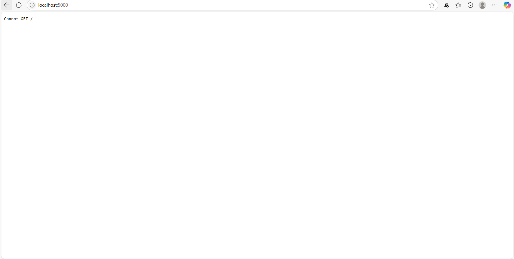

# WebsLearn - Learning Management System

A modern web-based learning management system built with React and Node.js.

## Features

- **User Authentication**: Register and login as student or instructor
- **Course Management**: Create, view, and manage courses
- **Student Dashboard**: Enroll in courses and track progress
- **Teacher Dashboard**: Create and manage your courses
- **Entertainment Section**: Videos and news content
- **Responsive Design**: Works on desktop and mobile devices

## Tech Stack

### Frontend
- React 19
- React Router DOM
- Axios for API calls
- Tailwind CSS for styling

### Backend
- Node.js
- Express.js
- MySQL2
- JWT for authentication
- bcryptjs for password hashing

## Setup Instructions

### Database Setup

1. Create a MySQL database called `webslearn`
2. Import the database schema:
   ```bash
   mysql -u root -p webslearn < backend/database.sql
   ```

### Backend Setup

1. Navigate to the backend directory:
   ```bash
   cd backend
   ```

2. Install dependencies:
   ```bash
   npm install
   ```

3. Configure environment variables:
   - Copy the `.env` file and update with your database credentials
   - Update `DB_PASSWORD` with your MySQL password

4. Start the backend server:
   ```bash
   npm run dev
   ```
   The server will run on ](image.png)

### Frontend Setup

1. Navigate to the frontend directory:
   ```bash
   cd frontend
   ```

2. Install dependencies:
   ```bash
   npm install
   ```

3. Start the development server:
   ```bash
   npm start
   ```
   The application will run on http://localhost:3000

## Default Users

The database includes sample users for testing:
- **Instructor**: instructor@example.com / password
- **Student**: student@example.com / password

## Project Structure

```
webslearn/
├── backend/
│   ├── index.js          # Main server file
│   ├── database.sql      # Database schema
│   ├── package.json      # Backend dependencies
│   └── .env             # Environment variables
├── frontend/
│   ├── src/
│   │   ├── components/   # Reusable React components
│   │   ├── pages/        # Page components
│   │   └── services/     # API service functions
│   ├── package.json      # Frontend dependencies
│   └── tailwind.config.js # Tailwind CSS configuration
└── README.md
```

## API Endpoints

### Authentication
- `POST /api/register` - Register new user
- `POST /api/login` - Login user

### Courses
- `GET /api/courses` - Get all courses
- `GET /api/courses/:id` - Get course details
- `POST /api/courses` - Create new course (instructor only)
- `GET /api/instructor/courses` - Get instructor's courses
- `GET /api/student/courses` - Get student's enrolled courses

### Enrollments
- `POST /api/enrollments` - Enroll in a course

### Entertainment
- `GET /api/entertainment` - Get entertainment content

### User
- `GET /api/profile` - Get user profile

## Usage

1. Register as either a student or instructor
2. **As an Instructor**:
   - Go to Teacher Dashboard
   - Create new courses
   - Manage your courses

3. **As a Student**:
   - Browse available courses
   - Enroll in courses
   - View enrolled courses in Student Dashboard

4. **Entertainment**: Browse videos and news content in the Entertainment section

## Contributing

1. Fork the repository
2. Create a feature branch
3. Make your changes
4. Submit a pull request

## License

This project is for educational purposes.
